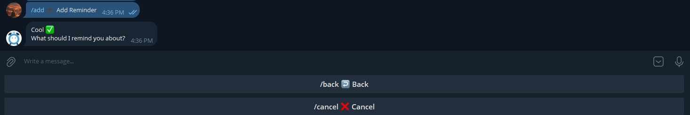
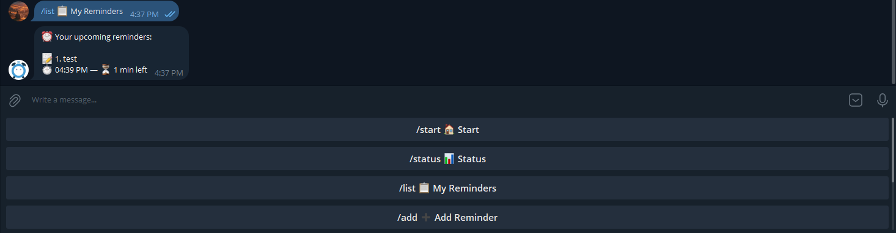
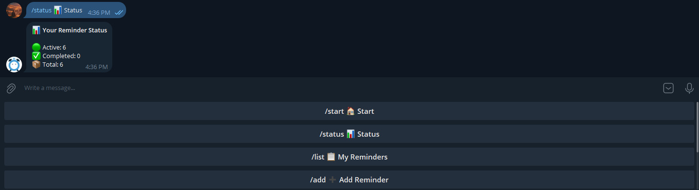

# ⏰ RemindersBot – Telegram Reminder Bot

**RemindersBot** is my **first Telegram bot**, built as part of a **3-hour hands-on course** focused on learning
Telegram bot development through a real, production-style project.

This bot allows users to **create reminders directly inside Telegram**, stores them in a **PostgreSQL database**, and
runs **24/7 on Heroku**.

The goal of this project was to move beyond theory and understand how a real backend-powered bot works end to end.

---

## ⚡ Quick Start (Local Setup)

```bash
git clone https://github.com/your-username/remindersbot.git
cd remindersbot
pip install -r requirements.txt
```

## 🔐 Environment Variables

This project uses environment variables for security.

Create a `.env` file based on `.env.example`:

```env
BOT_TOKEN=
DATABASE_URL=
```

## 🖼️ Screenshots

### Start Menu


### Add Reminder Flow



### List Reminders



### Status Overview



## 📌 Project Overview

RemindersBot is a **Telegram Reminder Bot** that allows users to:

- Add reminders step by step
- Store reminders persistently in a database
- Receive reminders automatically after a specified time
- View upcoming reminders using commands

This project represents my **first complete Telegram bot**, from creation with **BotFather** to **cloud deployment**.

---

## 🎯 What I Learned From This Project

By building this bot, I learned how to:

- ✅ Create and configure a Telegram bot using **BotFather**
- ✅ Handle Telegram updates, commands, and messages
- ✅ Build state-based conversations (step-by-step user flows)
- ✅ Store user data safely using **PostgreSQL**
- ✅ Use **psycopg2** for database communication
- ✅ Design simple backend logic for reminders
- ✅ Schedule background jobs (delayed reminder delivery)
- ✅ Manage environment variables securely
- ✅ Deploy and run a Telegram bot on **Heroku**
- ✅ Keep a backend service running continuously (24/7)
- ✅ Structure a Python project for maintainability

This project helped me understand how **Telegram bots behave like backend services**, not just scripts.

---

## 🤖 Bot Features

- `/start` – Start the bot and show main menu
- Add reminder via interactive buttons
- Store reminders in PostgreSQL
- Automatic reminder delivery
- `/list` – View upcoming reminders
- `/cancel` – Cancel current action
- `/status` – View reminder statistics
- Graceful error handling and user state management

---

## 🛠️ Technologies Used

- **Python**
- **Telegram Bot API**
- **BotFather**
- **PostgreSQL**
- **Heroku**
- **psycopg2**
- **PyCharm**
- **Git & GitHub**

---

## ⚙️ How the Bot Works (High Level)

1. The user interacts with the bot in Telegram
2. The bot processes updates using `python-telegram-bot`
3. Conversation state is stored per user
4. Reminders are saved in PostgreSQL
5. Background jobs send reminders at the correct time
6. The bot runs continuously on Heroku

---

## 🚀 Deployment

The bot is deployed on **Heroku** and uses **Heroku Postgres** for data storage.

Deployment highlights:

- Environment variables for secrets (`BOT_TOKEN`, `DATABASE_URL`)
- Worker-based execution
- Automatic restarts and monitoring
- Cloud-hosted PostgreSQL database

---

## 📂 Project Structure

.
├── database/
│ ├── db.py
│ └── actions.py
├── utils/
│ ├── constants.py
│ ├── helpers.py
│ └── job.py
├── main.py
├── requirements.txt
├── Procfile
├── .env.example
└── README.md


---

## 📚 Course Information

- **Course Duration:** ~3 hours
- **Focus:** Practical Telegram bot development
- **Level:** Beginner to early-intermediate
- **Approach:** Project-based, hands-on learning

---

## 🌱 Why This Project Matters

This repository demonstrates:

- My first real-world **Telegram bot**
- Practical backend development skills
- Experience with databases and cloud hosting
- Understanding of async event-driven systems
- Ability to deploy and maintain a running service

It marks an important step in my journey toward becoming a **backend-focused software engineer**.

---

## 🔮 Future Improvements

- Recurring reminders (daily / weekly)
- Time-based reminders (specific date & time)
- Timezone support
- Inline keyboards
- Reminder editing
- Auto-cleanup of old completed reminders

## 📬 Contact

If you’d like to discuss this project or collaborate:

- GitHub: **Ahmad**
- Telegram Bot: **@ahmad_reminder_bot**
- 🔗 Live Bot: https://t.me/ahmad_reminder_bot

---

⭐ If you find this project useful, feel free to star the repository!

